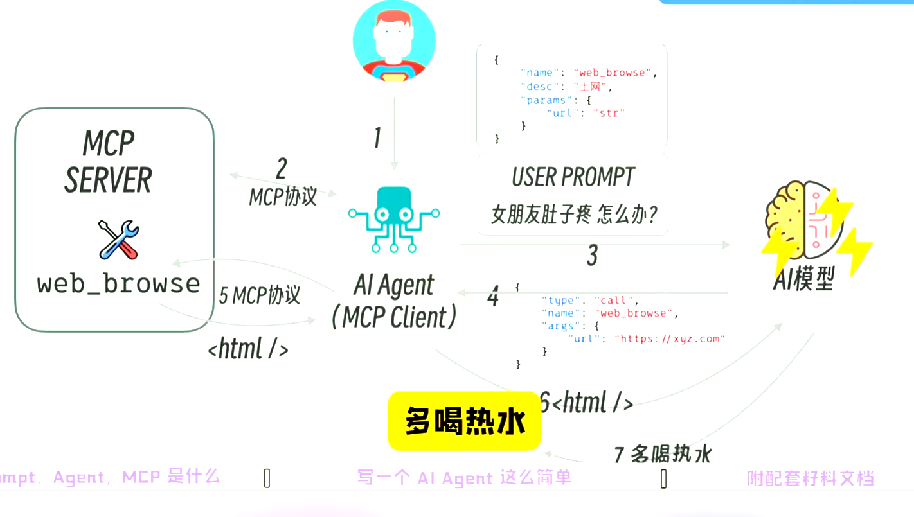

# AI 理论

## 一、理解

最开始，OpenAi 发布 GPT 时，ai 看起来只是一个聊天框，我们通过发送消息（用户 prompt-用户提示词），ai 通过不同模型进行回复（类比跟不同人说话得到的回复不一样），但很多时候如果没有详细设定，ai 就只能给出一个中肯的回答，如果想让 ai 更符合某个人设，就可以对它说你扮演某个角色去进行回复。

但如果每次都需要加一个预设，这样会导致用户输入过多与真实想问内容无关的词，所以就可以将预设这些提炼成 system_prompt，每次进行提问时不仅带上用户的 user_prompt，还要带上预设的 system_prompt。这个系统提示词就主要用来描述 ai 的角色、性格、场景、语气等。这样整个对话就会更加流畅自然。

## 二、AI Agent 和 AI Tools

**背景发展**： 由于 LLM 的发展，仅仅靠对话模型无法解决实际问题，因此引入了 AI Agent，即 AI 代理，它可以通过调用 AI Tools 来解决实际问题。

**AI Agent**
AI Agent 是一个基于 LLM 的智能代理，它可以与外部工具和应用程序进行交互，并使用 LLM 生成回复。

**AI Tools**
AI Tools 是一个工具库，它包含各种工具，如搜索、翻译、绘图、代码生成等。

## 三、function Coding

**背景**： system_prompt 由于 ai 模型回答不确定性可能返回的格式不对的内容，agent 就会采取反复重试，这种方式不太合理，所以大模型厂商推出 function coding。

**核心思想**： 统一格式，规范描述。

能有针对性的训练 ai， 有更良好的回复。

## 四、MCP： Model Context Protocol

那么 AI agent 里也会有一些通用的 AI tools，比如浏览网页，不可能每个 agent 都去写一个 web browser，所以，我们可以定义一个通用的格式（协议），然后让 AI agent 去实现这个格式。 这个协议就是 MCP。AI tools 即是 MCP server，调用它的即是 MCP client。

MCP：模型上下文协议， 是一种开放的技术协议，主要是标准化大型语言模型（LLM）与外部工具和服务的交互方式和应用程序向 LLM 提供上下文的方式。使得大型语言模型能够更高效地与外部系统进行交互 ‌。

**好处**：

- 标准化交互 ‌：MCP 通过标准化的规则，简化了 AI 模型与外部数据和工具的交互过程。它像是一个通用插头，使得 AI 模型能够与不同的系统进行交流，而不需要为每个系统进行定制设置 ‌。
- ‌ 提高效率 ‌：MCP 通过统一的 API 将 LLM 连接到各种应用程序，大幅降低了技术实现的难度和成本。它解决了传统方式中自定义解决方案数量呈几何级数增长的问题，简化了集成过程 ‌。
- ‌ 增强 AI 的实用性和智能性 ‌：MCP 赋予 AI 模型“记忆”和“触手”，使其能够调用工具、访问数据，从而提升其智能水平和实用性。它使得 AI 模型不再局限于处理语言任务，而是能够执行更复杂的操作 ‌。

整个流程：

1. 输入：用户输入问题。（通过 agent 进行提问）。
2. agent：通过 AI agent（MCP Client）处理，然后通过 mcp 协议，从 mcp server 获取 tools 信息，ai agent 会将 tools 信息转化成 system_prompt 或者 function_call，然后结合用户的 user_prompt，再打包发给模型，模型想去查一些内容，就可以通过 agent 去调用 mcp 服务拿到数据。
3. 模型： 通过模型处理计算，然后返回结果。
   
