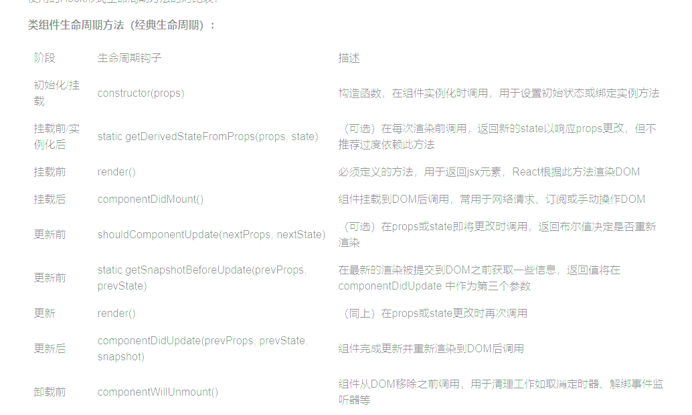

# React 基础知识

## 问题 1：什么是 React Hooks？

React Hooks 是 React 一种新的特性，它允许在函数组件中使用状态（state）、副作用和其它 react 特性，而无需编写类组件 ‌‌。

### 使用 React Hooks 好处是啥？

- **简化状态管理和副作用**：Hooks 允许你直接在函数组件中处理状态和副作用，无需类和复杂的生命周期方法。
- **逻辑拆分与重用**：通过自定义 Hooks，你可以将复杂的逻辑拆分成小的可重用单元，从而使代码更简洁、可读。

### 调度机制

优先级调度：Hooks 更新请求会被 Scheduler 模块根据优先级（Immediate/UserBlocking/Normal）排队处理
批量更新：React 自动合并多个 setState 调用，减少渲染次数

#### React 特性：

jsx 语法、组件化开发、单向数据流、组件状态管理、虚拟 dom、ssr。

- jsx 语法 ‌：JSX 是 JavaScript 的语法扩展，允许在 JavaScript 中书写类似 HTML 的代码，用于描述 UI 结构更加直观和简洁。
- 组件化开发 ‌：React 鼓励将 UI 拆分为独立的、可复用的组件。
- 单向数据流 ‌：数据通过 props 自上而下传递，这种单向数据流简化了状态管理和问题追踪，减少了数据流动的复杂性 ‌。
- 组件状态管理 ‌：React 通过 Hooks 来管理组件的状态，它允许在函数组件中管理状态，而不需要使用 class 组件。
- 虚拟 DOM ‌：React 使用虚拟 DOM 来提高性能，它将 UI 的更新操作与 DOM 的更新操作分离开，从而减少实际的 DOM 操作次数。
- ssr ‌：React 通过 SSR（服务器端渲染）来提高网站性能，它允许在服务器上渲染组件，然后将其发送给客户端，从而减少客户端的请求次数。

## 问题 2：组件的生命周期方法

React 组件的生命周期可以分为三个阶段：挂载阶段、更新阶段和卸载阶段。

- 挂载阶段包括`constructor`、`render`、`componentDidMount`等方法，用于初始化组件、渲染到真实 DOM 和处理副作用。
- 更新阶段包括`shouldComponentUpdate`、`render`、`componentDidUpdate`等方法，用于控制组件的重新渲染和处理更新后的副作用。
- 卸载阶段包括`componentWillUnmount`方法，用于清理组件产生的副作用和资源



| 类组件生命周期方法    | 对应的 Hooks 功能                                                                                   |
| --------------------- | --------------------------------------------------------------------------------------------------- |
| constructor           | N/A（直接在函数组件中初始化状态即可，如使用 useState 初始化状态）                                   |
| componentDidMount     | useEffect(() => { }, []) （传入一个空数组作为依赖项，表示在组件挂载后执行一次）                     |
| shouldComponentUpdate | React.memo（对于函数组件，用于优化不必要的渲染）或者在 useEffect 的依赖数组中精确定义需要监听的变化 |
| componentDidUpdate    | useEffect(() => { }, [props]) （传入依赖项数组，当这些依赖项变化时执行）                            |
| componentWillUnmount  | useEffect(() => { return () => { } }, []) 返回的清理函数（在组件卸载前执行清理操作）                |

> 新生命周期只有这个带`will`的没有被移除，其余 3 个`componentWillMount`、`componentWillReceiveProps`、`componentWillUpdate`被移除了。

## 问题 3：React 组件可请求数据生命周期钩子

- `componentDidMount`：组件挂载后立即调用，在此方法中可以发起请求，并更新组件的状态或 props。
- `componentDidUpdate`：组件更新后立即调用，在此方法中可以根据 props 或 state 的变化发起请求，

## 问题 4：什么是高阶组件

高阶组件（Higher-Order Component）是一个函数，它<u>接收一个组件作为参数，返回一个新的组件</u>。高阶组件的作用是复用组件的逻辑，并返回一个增强后的组件。

## 问题 5：受控组件 和 非受控组件

- **受控组件**：表单元素的数据是由 React 的 State 来管理。

> 其实就是实现了一个类似 Vue 的 v-model 的机制，通过 onChange 事件来更新 value，这样就实现了受控组件。

::: details 例如：

我们在界面的输入框中输入内容，这时候你会发现这个 value 是只读的，无法修改，还会报错

```tsx
import React, { useState } from "react";

const App: React.FC = () => {
  const [value, setValue] = useState("");
  return (
    <>
      <input type="text" value={value} />
      <div>{value}</div>
    </>
  );
};

export default App;
```

当用户输入内容的时候，value 并不会自动更新，这时候就需要我们手动实现一个 onChange 事件来更新 value。

```tsx
import React, { useState } from "react";

const App: React.FC = () => {
  const [value, setValue] = useState("");
  const handleChange = (e: React.ChangeEvent<HTMLInputElement>) => {
    setValue(e.target.value);
  };
  return (
    <>
      <input type="text" value={value} onChange={handleChange} />
      <div>{value}</div>
    </>
  );
};

export default App;
```

:::

```jsx
import React, { useState } from "react";

// 受控组件
function ControlledComponent() {
  const [inputValue, setInputValue] = useState("");

  const handleChange = (event) => {
    setInputValue(event.target.value);
  };

  return (
    <div>
      <input type="text" value={inputValue} onChange={handleChange} />
      <p>输入的内容: {inputValue}</p>
    </div>
  );
}

export default ControlledComponent;
```

- **非受控组件**：是指表单元素不受 React 的 State 管理。它的状态通常通过 ref 从 DOM 中获取。

> 采用 `defaultValue`，变为非受控组件

```jsx {13}
import React, { useState, useRef } from "react";
const App = () => {
  const value = "wifi";
  const inputRef = useRef(null);
  const handleChange = () => {
    console.log(inputRef.current?.value);
  };
  return (
    <>
      <input
        type="text"
        onChange={handleChange}
        defaultValue={value}
        ref={inputRef}
      />
    </>
  );
};

export default App;
```

- **特殊的非受控组件**：对于 file 类型的表单控件，它是一个特殊的组件，因为它的值只能由用户通过文件选择操作来设置，而不能通过程序直接设置，所以<u>`file`只能是非受控组件</u>。

> 受控组件适用于所有表单元素，包括 input、textarea、select 等。但是除了 `input type="file"` 外，其他表单元素都推荐使用受控组件。

## 问题 6：类组件 和 函数式组件 区别

### 类组件（Class component）：

- 通过继承 React.Component 类来定义组件。
- 可以包含自己的状态（state）和生命周期方法。
- 可以使用 this 关键字来访问组件的状态和 props。
- 可以使用 ref 来访问 DOM 元素或子组件。
- 可以使用 setState 方法来更新组件的状态，触发组件的重新渲染。
- 通常用于复杂的组件，需要管理自己的状态并响应生命周期事件。

### 函数式组件（Functional component）：

- 通过函数来定义组件，接收 props 作为参数，返回 JSX 元素。
- 没有自己的状态和生命周期方法。
- 不能使用 this 关键字来访问组件的状态和 props。
- 通常用于简单的展示组件，只关注 UI 的呈现和展示，不需要管理状态和响应生命周期事件。

## 问题 7：React 中组件通信方式

- 父传子
  - props、Context 上下文（useContext）
- 子传父
  - 回调函数（通过父组件向子组件 props 传递一个函数，由子组件向函数中传递参数，父组件接收）
- 子孙组件
  - Context 上下文（useContext）
- 跨级组件
  - window
  - context
  - 自定义 hooks
  - 类似全局事件总线（例如：第三方库 PubSubJS），原理：消息的发布订阅机制
  - 状态管理库（redux、zustand,mobx）

1、通常建议遵循 React 数据流向单向数据绑定的原则，尽量避免直接访问子组件的状态。

2、使用回调函数是一种更符合 React 设计理念的方式，它促进了组件之间的解耦和可复用性。

3、Refs 主要用于获取 DOM 节点或在必要时获取子组件实例进行一些特殊操作，而不鼓励常规情况下频繁获取子组件的状态。

## 问题 8：React 是 mvvm 框架吗？

- React 不是一个典型的 MVVM（Model-View-ViewModel）框架。
- React 强调单向数据流的概念，其中数据从父组件通过 props 传递给子组件，子组件通过回调函数将状态更改传递回父组件。这种单向数据流的模型有助于构建可预测和可维护的组件，但与典型的双向绑定的 MVVM 模式不同。

## 问题 9：React 性能优化方案

1. 使用 React.memo()来缓存组件，该组件在 props 没有变化时避免不必要的渲染(类组件使用 PureComponent，类似的作用)。
2. 使用 React.lazy()和 Suspense 来延迟加载组件。可降低初始加载时间，并提高应用程序的性能。
3. 使用 React.useCallback()和 React.useMemo()来缓存函数和计算结果，避免不必要的函数调用和计算。类组件使用 shouldComponentUpdate()生命周期方法来手动控制是否更新组件。
4. 使用 React.Fragment 来避免不必要的 DOM 节点。可减少 DOM 节点数量，提高应用程序的性能。
5. 减少不必要的嵌套层次，合理利用 key 属性，使 React 的 diff 算法更高效。
6. 事件处理优化，使用合成事件。
7. 使用 ReactDOM.createPortal：将某些组件渲染到根 DOM 之外，比如渲染到 document.body，可以避免不必要的 re-render。
8. CSS 动画与交互优化：配合 requestAnimationFrame 等 API 来处理复杂的动画，减少不必要的布局重排和重绘。

## 问题 10：refs 的作用

在 React 中，refs（引用）是用于访问组件或 DOM 元素的方法。

1. **访问组件实例**：通过 refs，可以获取到组件的实例，从而可以直接调用组件的方法或访问组件的属性。这在某些情况下非常有用，例如需要手动触发组件的某个方法或获取组件的状态。
2. **访问 DOM 元素**：通过 refs，可以获取到 React 组件中的 DOM 元素，从而可以直接操作 DOM，例如改变样式、获取输入框的值等。这在需要直接操作 DOM 的场景下非常有用，但在 React 中应该尽量避免直接操作 DOM，而是通过状态和属性来控制组件的渲染。

## 问题 11：React 项目是如何捕获错误的？

React 16 及更高版本引入了错误边界这一概念，它是一种特殊的 React 组件，能够在其子组件树中捕获任何渲染错误或其他 JavaScript 错误。当错误边界内的任何子组件抛出错误时，错误边界能够捕获这个错误，记录日志，并且可以选择性地显示恢复界面，而不是让整个应用程序崩溃。

在 react16 中引入了错误边界，来捕获错误，做出降级处理。

- 使用 `static getDerivedStateFromError()` 做 UI 降级。
- 使用 `componentDidCatch()` 打印错误信息。

**可以捕获的错误**：渲染层面的错误 和 生命周期方法中的错误。

> ⚠️ 注意：以下异常无法捕获
>
> 1. 事件处理函数中抛出的异常
>
> 2. 异步代码中抛出的异常
>
> 3. 错误边界自身抛出的错误：如果错误边界组件本身抛出了错误，则它无法捕获该错误。

::: code-group

```tsx [ErrorBoundary组件]
class ErrorBoundary extends React.Component {
  constructor(props) {
    super(props);
    this.state = { hasError: false };
  }

  static getDerivedStateFromError(error) {
    // 更新 state 使下一次渲染能够显示降级后的 UI。
    return { hasError: true };
  }

  componentDidCatch(error, errorInfo) {
    // 你同样可以将错误日志上报给服务器。
    logErrorToMyService(error, errorInfo);
  }

  render() {
    if (this.state.hasError) {
      // 你可以自定义降级后的 UI 并渲染。
      return <h1>Something went wrong.</h1>;
    }
    return this.props.children;
  }
}
```

```tsx [使用ErrorBoundary]
<ErrorBoundary>
  <MyComponent />
  {/* ...其余业务组件 */}
</ErrorBoundary>
```

:::

## 问题 12：React 中 ‌ 自定义 Hook 的规范

1. 命名规范

- ‌ 以“use”开头 ‌：自定义 Hook 的命名必须以“use”开头，这是 React 和 Vue 中自定义 Hook 的命名约定。例如，useCounter、useFetchData 等 ‌
- ‌ 函数形式 ‌：自定义 Hook 是一个函数，用于封装可复用的逻辑。

2. 使用规范

- ‌ 只能在函数组件中使用 ‌：自定义 Hook 只能在函数组件中使用，不能在普通的 JavaScript 函数中使用。例如，不能在类组件或普通的 JavaScript 函数中调用自定义 Hook‌
- ‌ 只能在顶层调用 ‌：自定义 Hook 必须在函数组件的顶层调用，不能在循环、条件或嵌套函数中调用。确保每次组件渲染时 Hook 的调用顺序完全相同 ‌
- ‌ 可以调用其他 Hook‌：自定义 Hook 可以调用其他内置的 React Hooks（如 useState、useEffect 等）。

## 问题 13：React 什么不能在循环、条件或嵌套函数中调用 Hook？

原因是 React 依赖 hook 调用顺序，内部采用 index 下标去识别每个 Hook 的位置，
若在条件或循环中调用 Hook，会导致调用顺序不一致，破坏内部 Hook 栈，从而引发运行时错误或逻辑异常。

## 问题 14： React 事件机制

React 的事件机制与原生 DOM 事件机制不同，它基于 合成事件（SyntheticEvent）构建，提供了跨浏览器的事件统一处理方式和更好的性能。

**合成事件：**

合成事件是对浏览器原生事件的封装，它们提供了相同的接口和功能，但在内部处理上做了优化。保证了事件处理的跨浏览器一致性，并且使用了事件委托、对象池等提供了额外的性能优化。

**合成事件的优势：**

1. 跨浏览器一致性：React 使用了合成事件，因此事件处理 across browsers consistently。
2. 性能优化：React 使用了事件委托（event delegation），从而避免了在每个 DOM 元素上添加事件监听器。事件池：React 为每个事件创建一个池，重用事件对象，避免了频繁的内存分配。
3. 统一的接口：合成事件实现了与原生 DOM 事件类似的接口，支持 stopPropagation、preventDefault 等常用方法。

## 问题 15：为什么父组件更新会导致所有子组件渲染？如何避免？

react 默认采用"render and diff"策略，使用 React.memo/shouldComponentUpdate 阻断无效更新

## 问题 16：函数组件每次渲染都会创建新函数，如何避免传递新 props？

使用 useCallback 缓存函数引用

```js
const handleSubmit = useCallback(() => {
  /*...*/
}, [deps]);
```

## 问题 17：useEffect 和 useLayoutEffect 的区别？

useEffect 异步执行（不阻塞渲染）
useLayoutEffect 同步执行（在 DOM 更新后，浏览器绘制前）

useLayoutEffect总是比useEffect先执行。

## 问题 18： Redux 原理

从 Flux 中衍生来的（单一数据源，单向数据流）

答：Redux 是一个JavaScript状态管理库,提供可预测化的状态管理。我的理解是，redux 是为了解决 react 组件间通信和组件间状态共享而提出的一种解决方案，主要包括 3 个部分，（store + action + reducer）。

底层原理： 基于单一全局状态树（store）和纯函数（reducer）的设计模式，确保状态更新的可预测性和一致性。基于发布订阅模式，通过订阅的方式监听数据的变化。当数据变化时，所有订阅者都会收到通知并更新自己。


发布订阅模式/Proxy+Reflect 代理模式

**Redux 的核心概念是什么？**

- Store：保存应用所有状态的对象。
- Action：描述发生事件的普通对象，用来告诉 Store 有事情发生了。
- Reducer：指定应用状态如何变化的纯函数。接收先前的状态和一个 action，返回新的状态。

**解释一下 Redux 中的中间件（Middleware）？**

回答： 中间件提供第三方的扩展点，通常用来处理异步操作、日志记录、创建崩溃报告等。例如，redux-thunk 和 redux-saga 是常用的中间件，用于处理异步逻辑。

**三个基本原则**

> 单一真实数据源：整个应用的状态被存储在一个对象树中，并且这个对象树只存在于一个单一的 store 中。

> 状态是只读的：改变状态的唯一途径是触发 action，action 是一个描述发生事件的普通对象。

> 使用纯函数来执行修改：为了指定应用如何对 actions 响应，你需要编写 reducers。

store：用来存储当前 react 状态机（state）的对象。connect 后，store 的改变就会驱动 react 的生命周期循环，从而驱动页面状态的改变
State: store 对象包含的所有数据
action: 用于接受 state 的改变命令，是改变 state 的唯一途径和入口。一般使用时在当前组件里面调用相关的 action 方法，通常把和后端的通信(ajax)函数放在这里
reducer: action 的处理器，用于修改 store 中 state 的值，返回一个新的 state 值
Dispatch: view 发出 action 的唯一方法

### 使用

**步骤 1: 创建 Store**

首先，你需要创建一个 Redux store。这个 store 将持有整个应用的状态树。

```js
import { createStore } from "redux";
import rootReducer from "./reducers";

const store = createStore(rootReducer);
```

**步骤 2: 定义 Actions**

然后，定义 actions，这些 actions 描述了发生的事件（如用户点击按钮）。每个 action 都有一个类型属性。

```js
const ADD_TODO = "ADD_TODO";
const addTodoAction = (text) => ({
  type: ADD_TODO,
  text,
});
```

**步骤 3: 编写 Reducers**

接着，编写 reducers 来处理这些 actions，并返回新的状态。Reducer 是一个纯函数，它接收先前的状态和一个 action 作为参数，返回新的状态。

```js
function todosReducer(state = [], action) {
  switch (action.type) {
    case ADD_TODO:
      return [...state, { text: action.text, completed: false }];
    default:
      return state;
  }
}
```

**步骤 4: 在 React 组件中使用 Redux**

最后，在你的 React 组件中使用 useSelector 和 useDispatch 来访问和修改状态。

```js
import React from "react";
import { useSelector, useDispatch } from "react-redux";
import { addTodoAction } from "./actions"; // 导入上面定义的 action creator

function TodoList() {
  const todos = useSelector((state) => state.todos); // 从 store 中读取 todos 状态
  const dispatch = useDispatch(); // 获取 dispatch 函数来派发 actions

  const handleAddTodo = () => {
    dispatch(addTodoAction("New Todo")); // 派发一个添加 todo 的 action
  };

  return (
    <div>
      <button onClick={handleAddTodo}>Add Todo</button>
      <ul>
        {todos.map((todo, index) => (
          <li key={index}>{todo.text}</li>
        ))}
      </ul>
    </div>
  );
}
```

## 问题 19 ： React Router.

React Router 是一个用于处理路由的库，它允许你创建单页应用程序（SPA）并实现路由功能。管理不同视图的切换，无需重新加载页面。

**路由器类型：**

1. Hash Router：使用 URL 的 hash 部分来表示路由, 有#号(example/#/path)。
2. Browser Router：使用 URL 的路径部分来表示路由 (example.com/path)。
3. memory Router：路由保存在内存中，不能前进后退（因为地址栏没变化）。
4. static Router：静态路由。

```js
<Route path="/users" element={<Users />} />
<Route path="/about" element={<About />} />

// 导航组件
<Link to="/users">Users</Link>
<Link to="/about">About</Link>

<Route path="/old" element={<Navigate to="/new" />} />

// 跳转方式
1. <Link to="/">Home</Link>
2. <button onClick={() => navigate(-1)}>Go Back</button>
3. <NavLink to="/">Home</NavLink>


```

**router 如何路由传参**

- url 传参
- 在路径中定义参数。
- 使用 Link 或 navigate 传递状态。
  ```js
    <Link to="/details" state={{ name: 'John' }}>User John</Link>
    <button onClick={() => navigate('/details', { state: { name: 'John' } })}>User John</button>
  ```

**查询参数**

1. 使用 url 获取
2. 使用 useLocation 获取参数
3. 使用 useParams 钩子获取参数
4. 使用 useSearchParams 获取参数
