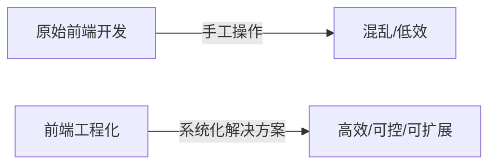

## 什么是前端工程化？

**前端工程化**是将软件工程的方法、流程、工具和标准化实践应用于前端开发，旨在提高开发效率、保障代码质量、优化性能、降低维护成本，并实现项目可持续扩展的系统化过程。它使前端开发从原始的"手工作坊模式"升级为"工业化生产线"。

### 核心本质理解


## 为什么需要前端工程化？（痛点驱动）

| 传统开发痛点             | 工程化解决方案              |
|--------------------------|-----------------------------|
| 手动刷新页面调试效率低   | 热更新（HMR）               |
| 全局变量污染、依赖混乱   | 模块化（ES Modules）        |
| 代码风格不一难维护       | 代码规范（ESLint/Prettier） |
| 手动压缩合并资源         | 自动化构建（Webpack/Vite）  |
| 兼容性问题难排查         | 编译转换（Babel/PostCSS）   |
| 重复搭建项目环境         | 脚手架工具（create-react-app）|

## 前端工程化的五大核心维度

### 1. 开发流程标准化
- **脚手架工具**：Vite/Vue CLI/Create React App
- **目录结构规范**：强制约定的项目组织方式
- **代码规范**：ESLint + Prettier + Stylelint
- **Git工作流**：Git Hooks + Commit Lint
```bash
# 典型工程化项目结构
my-project/
├── src/                # 源代码
├── public/             # 静态资源
├── .eslintrc.js        # 代码规范
├── .prettierrc         # 格式化配置
├── vite.config.js      # 构建配置
└── package.json        # 工程化配置中枢
```

### 2. 模块化与组件化
- **模块化**：
  ```javascript
  // ES Module 规范
  import { utils } from './lib/utils.js';
  export default function Component() {...}
  ```
- **组件化**：
  ```jsx
  // React组件示例
  const Button = ({ children }) => (
    <button className="ui-button">{children}</button>
  );
  ```

### 3. 自动化构建体系

- **关键环节**：
  - 依赖打包（Webpack/Rollup）
  - 语法降级（Babel）
  - CSS预处理（Sass/Less）
  - 资源优化（压缩/雪碧图/字体处理）

### 4. 质量保障体系
| 环节         | 工具                     | 作用                     |
|--------------|--------------------------|--------------------------|
| 单元测试     | Jest/Vitest              | 验证函数/组件逻辑        |
| E2E测试      | Cypress/Playwright       | 模拟用户操作验证功能流   |
| 类型检查     | TypeScript               | 编译时类型安全           |
| 代码覆盖率   | Istanbul/nyc             | 测试完整性评估           |
| 性能监控     | Lighthouse/Web Vitals    | 性能指标量化             |

### 5. 自动化部署运维
- **持续集成**：GitHub Actions/GitLab CI
- **部署策略**：
  ```mermaid
  graph TB
  A[代码提交] --> B[自动化测试] --> C{测试通过？}
  C -->|Yes| D[构建产物]
  C -->|No| E[通知失败]
  D --> F[自动部署CDN]
  F --> G[版本回滚机制]
  ```
- **监控体系**：Sentry（错误监控）、Prometheus（性能监控）

## 工程化的核心价值体现

1. **开发效率倍增**
   - 热更新使保存代码到界面更新<1s
   - 脚手架5分钟搭建完整开发环境

2. **质量可控性强**
   - ESLint拦截70%低级错误
   - 自动化测试覆盖核心业务路径

3. **性能优化自动化**
   - 打包自动生成按需加载的chunk
   - 图片压缩节省50%+带宽
   - Tree Shaking消除未使用代码

4. **团队协作标准化**
   - 统一规范使代码可读性提升200%
   - 新人上手时间从3天缩短至3小时

## 现代工程化技术栈示例

| 领域          | 技术选型                              |
|---------------|---------------------------------------|
| 开发框架      | React/Vue/Svelte                     |
| 构建工具      | Vite/Webpack/Rollup                  |
| 包管理        | npm/pnpm/yarn                        |
| 样式方案      | CSS Modules/Tailwind/Sass            |
| 状态管理      | Redux/Pinia/Zustand                  |
| 路由方案      | React Router/Vue Router              |

## 实践建议：如何实施工程化？

1. **渐进式接入**
   ```mermaid
   graph LR
   A[代码规范] --> B[自动化构建] --> C[组件化] --> D[测试体系] --> E[CI/CD]
   ```

2. **避免过度工程化**
   - 小型项目：Vite + ESLint 即可
   - 中型项目：增加单元测试
   - 复杂应用：完整工程化方案

3. **工具选型原则**
   - 社区活跃度 > 功能新颖性
   - 文档完整性 > 技术先进性
   - 团队熟悉度 > 业界流行度

## 总结：工程化的本质

前端工程化是通过 **标准化、自动化、平台化** 的手段，解决"人脑记忆不可靠"、"手工操作易出错"、"系统复杂度攀升"三大核心问题。它不是特定工具的堆砌，而是建立**可持续演进的技术体系**，最终实现：
```
高质量代码 × 高效协作 × 极致用户体验
```

> 💡 **关键认知**：工程化程度应与项目复杂度正相关。过度工程化会增加维护成本，不足则导致开发效率低下。理想状态是让工程化设施像"水电煤"一样无形支撑业务开发。