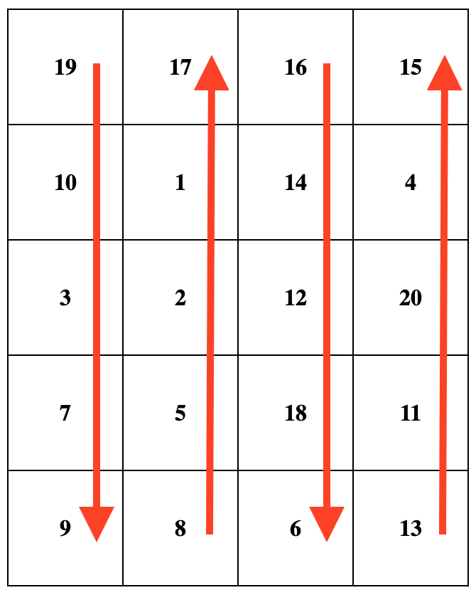
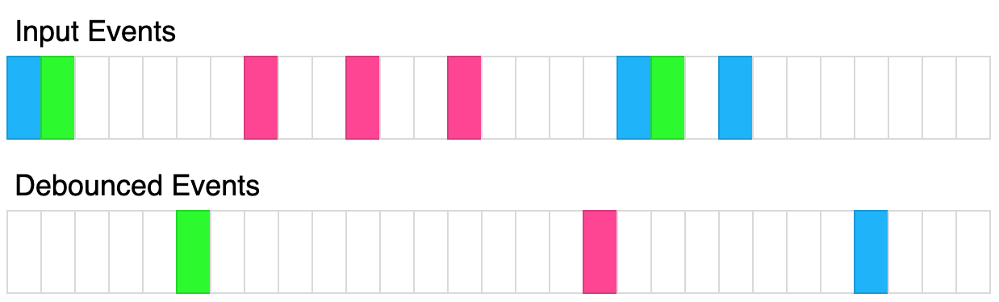

# 算法题

## 问题 1：还原一棵树

实现 `buildTree` 方法

```js
const list = [
  { id: "a2", label: "1", pid: "a1" },
  { id: "a3", label: "2", pid: "a17" },
  { id: "a1", label: "3", pid: "root" },
  { id: "a4", label: "4", pid: "a3" },
  { id: "a5", label: "5", pid: "a4" },
  { id: "ax", label: "6", pid: "a5" },
  { id: "ay", label: "7", pid: "a5" },
  { id: "a6", label: "8", pid: "a4" },
  { id: "a7", label: "9", pid: "a6" },
  { id: "a9", label: "10", pid: "a7" },
  { id: "a10", label: "11", pid: "a9" },
  { id: "a11", label: "12", pid: "a10" },
  { id: "a12", label: "13", pid: "a10" },
  { id: "a13", label: "14", pid: "a10" },
  { id: "a14", label: "15", pid: "a11" },
  { id: "a15", label: "16", pid: "a12" },
  { id: "a16", label: "17", pid: "a13" },
  { id: "a17", label: "18", pid: "a2" },
];

function buildTree(node, list) {}

const tree = buildTree({ id: "root", name: "root", pid: null }, list);
console.log(JSON.stringify(tree));
```

**解析：**

```js
function buildTree(node, list) {
  const children = list.filter((item) => item.pid === node.id);
  if (children.length > 0) {
    node.children = children.map((item) => buildTree(item, list));
  }
  return node;
}
```

## 问题 2：合并排序

给定两个已排序（升序）好的数组，将两个数组合并为一个新的数组，并使新数组仍然有序

```js
function mergeSort(arr1, arr2) {}

console.log(mergeSort([1, 3, 5], [2, 4, 6, 8])); // [1, 2, 3, 4, 5, 6, 8]
```

**解析**：双指针

```md
⬇️
1, 3, 5
2, 4, 6
⬆️
result = []
比较两个指针的值，小的放入 result 中，指针后移
```

```js
function mergeSort(arr1, arr2) {
  // arr1的指针
  let p1 = 0;
  // arr2的指针
  let p2 = 0;
  // 存放最后排序结果的数组
  const result = [];

  while (p1 < arr1.length || p2 < arr2.length) {
    if (arr1[p1] < arr2[p2]) {
      // arr1[i] 比 arr2[j] 小
      result.push(arr1[p1]);
      p1++;
    } else if (arr1[p1] > arr2[p2]) {
      // arr1[i] 比 arr2[j] 大
      result.push(arr2[p2]);
      p2++;
    } else if (p1 >= arr1.length) {
      // arr1已经走完，将arr2剩余内容放入result中
      result.push(arr2[p2]);
      p2++;
    } else if (p2 >= arr2.length) {
      // arr2已经走完，将arr1剩余内容放入result中
      result.push(arr1[p1]);
      p1++;
    }
  }

  return result;
}

console.log(mergeSort([1, 3, 5], [2, 4, 6, 8])); // [1, 2, 3, 4, 5, 6, 8]
```

## 问题 3：使用自定义上下文调用函数（手写 call）

增强所有函数，使其具有 callPolyfill 方法。该方法接受一个对象 obj 作为第一个参数，以及任意数量的附加参数。obj 成为函数的 this 上下文。附加参数将传递给该函数（即 callPolyfill 方法所属的函数）。

例如，如果有以下函数：

```js
function tax(price, taxRate) {
  const totalCost = price * (1 + taxRate);
  console.log(`The cost of ${this.item} is ${totalCost}`);
}
```

调用 tax(10, 0.1) 将输出 "The cost of undefined is 11" 。这是因为 this 上下文未定义。

然而，调用 tax.callPolyfill({item: "salad"}, 10, 0.1) 将输出 "The cost of salad is 11" 。this 上下文被正确设置，函数输出了适当的结果。

请在不使用内置的 Function.call 方法的情况下解决这个问题。

**解析**：

```js
Function.prototype.callPolyfill = function (context, ...args) {
  ctx = context || window;
  const key = Symbol();
  ctx[key] = this;
  const result = ctx[key](...args);
  delete ctx[key];
  return result;
};
```

**拓展**：

```js
//  手写apply 跟call类似，只是参数不同，apply 参数是一个数组
Function.prototype.myApply = function (context, args) {
  const fn = this;
  const key = Symbol();
  context = context || window;
  context[key] = fn;
  const result = context[key](...args);
  delete context[key];
  return result;
};
// 手写bind
Function.prototype.myBind = function (context, ...args) {
  const fn = this;
  return function (...innerArgs) {
    return fn.call(context, ...args, ...innerArgs);
  };
};
```

## 问题 4：排序方式

给定一个数组 arr 和一个函数 fn，返回一个排序后的数组 sortedArr。你可以假设 fn 只返回数字，并且这些数字决定了 sortedArr 的排序顺序。sortedArr 必须按照 fn 的输出值 升序 排序。

你可以假设对于给定的数组，fn 不会返回重复的数字。
**解析**：

```js
/**
 * @param {Array} arr
 * @param {Function} fn
 * @return {Array}
 */
var sortBy = function(arr, fn) {
   return arr.sort((acc, cur) => fn(acc) - fn(cur));
};

不使用sort：冒泡（性能不佳）
var sortBy = function(arr, fn) {
   const result =[...arr];
    for (let i = 0; i < result.length; i++) {
        for (let j = 0; j < result.length - i - 1; j++) {
            if (fn(result[j]) > fn(result[j + 1])) {
                [result[j], result[j + 1]] = [result[j + 1], result[j]];
            }
        }
    }
    return result;
}
```

## 问题 5： 转换数组中的每个元素

编写一个函数，这个函数接收一个整数数组 arr 和一个映射函数 fn ，通过该映射函数返回一个新的数组。

返回数组的创建语句应为 returnedArray[i] = fn(arr[i], i) 。

请你在不使用内置方法 Array.map 的前提下解决这个问题。

**解析**：

```js
/**
 * @param {number[]} arr
 * @param {Function} fn
 * @return {number[]}
 */
var map = function (arr, fn) {
  return arr.reduce((pre, item, i) => {
    pre.push(fn(item, i));
    return pre;
  }, []);
};
var map2 = function (arr, fn) {
  let returnedArray = [];
  for (let i = 0; i < arr.length; i++) {
    returnedArray[i] = fn(arr[i], i);
  }
  return returnedArray;
};
```

## 问题 6：执行可取消的延迟函数

给定一个函数 fn ，一个参数数组 args 和一个以毫秒为单位的超时时间 t ，返回一个取消函数 cancelFn 。

在 cancelTimeMs 的延迟后，返回的取消函数 cancelFn 将被调用。

setTimeout(cancelFn, cancelTimeMs)
最初，函数 fn 的执行应该延迟 t 毫秒。

如果在 t 毫秒的延迟之前调用了函数 cancelFn，它应该取消 fn 的延迟执行。否则，如果在指定的延迟 t 内没有调用 cancelFn，则应执行 fn，并使用提供的 args 作为参数。

**解析**：

```js
/**
 * @param {Function} fn
 * @param {Array} args
 * @param {number} t
 * @return {Function}
 */
var cancellable = function (fn, args, t) {
  let timer = setTimeout(() => fn(...args), t);
  return function cancel() {
    clearTimeout(timer);
  };
};
```

## 问题 7： 计数器

给定一个整型参数 n，请你编写并返回一个 counter 函数。这个 counter 函数最初返回 n，每次调用它时会返回前一个值加 1 的值 ( n , n + 1 , n + 2 ，等等)。
**解析**：

```js
var createCounter = function (n) {
  return function () {
    return ++n;
  };
};
```

## 问题 8： 根据 ID 合并两个数组

现给定两个数组 arr1 和 arr2 ，返回一个新的数组 joinedArray 。两个输入数组中的每个对象都包含一个 id 字段。

joinedArray 是一个通过 id 将 arr1 和 arr2 连接而成的数组。joinedArray 的长度应为唯一值 id 的长度。返回的数组应按 id 升序 排序。

如果一个 id 存在于一个数组中但不存在于另一个数组中，则该对象应包含在结果数组中且不进行修改。

如果两个对象共享一个 id ，则它们的属性应进行合并：

如果一个键只存在于一个对象中，则该键值对应该包含在对象中。
如果一个键在两个对象中都包含，则 arr2 中的值应覆盖 arr1 中的值。

**解析**

```js
/**
 * @param {Array} arr1
 * @param {Array} arr2
 * @return {Array}
 */
var join = function (arr1, arr2) {
  const map = new Map();
  arr1.concat(arr2).forEach((item) => {
    map.set(item.id, {
      ...map.get(item?.id),
      ...item,
    });
  });
  return [...map.values()].sort((a, b) => a.id - b.id);
  // 方式一：普通方式超时：
  // let joinedArray = [...arr1];
  // arr2.forEach((item) => {
  //   const index = arr1.findIndex((x) => x.id === item.id);
  //   if (index === -1) {
  //     joinedArray.push(item);
  //   } else {
  //     joinedArray[index] = {
  //       ...joinedArray[index],
  //       ...item,
  //     };
  //   }
  // });
  // return joinedArray.sort((a, b) => a.id - b.id);

  // 方式二：
  // const map = new Map(arr1.map((item) => [item.id, item]));
  // arr2.forEach((item) => {
  //   if (map.has(item.id)) {
  //     const oldItem = map.get(item.id);
  //     map.set(item.id, { ...oldItem, ...item });
  //   } else {
  //     map.set(item.id, item);
  //   }
  // });
  // return [...map.values()].sort((a, b) => a.id - b.id);
};
```

## 问题 9： 手写 Promise

```js
const PENDING = "pending";
const FULFILLED = "fulfilled";
const REJECTED = "rejected";

class MyPromise {
  #_status = PENDING;
  #_result;
  #thenables = [];

  constructor(executor) {
    const resolve = (data) => {
      // console.log("resolve", data);
      this.#changeStatus(FULFILLED, data);
    };
    const reject = (reason) => {
      // console.log("reject", reason);
      this.#changeStatus(REJECTED, reason);
    };
    try {
      executor(resolve, reject);
    } catch (error) {
      reject(error);
    }
  }

  // 状态一旦改变就不能再改变
  #changeStatus(status, result) {
    if (this.#_status !== "pending") return;
    this.#_status = status;
    this.#_result = result;
    this.#run();
  }

  #handleCallback(callback, resolve, reject) {
    if (typeof callback !== "function") {
      queueMicrotask(() => {
        const settled = this.#_status === FULFILLED ? resolve : reject;
        settled(this.#_result);
      });
      return;
    }
    queueMicrotask(() => {
      try {
        const result = callback(this.#_result);
        if (result instanceof MyPromise || result instanceof Promise) {
          result.then(resolve, reject);
        } else {
          resolve(result);
        }
      } catch (error) {
        reject(error);
      }
    });
  }
  #run() {
    if (this.#_status === PENDING) return;
    while (this.#thenables.length) {
      const { onFulfilled, onRejected, resolve, reject } =
        this.#thenables.shift();
      if (this.#_status === FULFILLED) {
        this.#handleCallback(onFulfilled, resolve, reject);
      } else {
        this.#handleCallback(onRejected, resolve, reject);
      }
    }
  }
  then(onFulfilled, onRejected) {
    return new MyPromise((resolve, reject) => {
      this.#thenables.push({
        onFulfilled,
        onRejected,
        resolve,
        reject,
      });
      this.#run();
    });
  }
  catch(onRejected) {
    return this.then(null, onRejected);
  }
  finally(onFinally) {
    return this.then(
      (value) => {
        onFinally();
        return value;
      },
      (reason) => {
        onFinally();
        throw reason;
      }
    );
  }
  static resolve(value) {
    return new MyPromise((resolve) => resolve(value));
  }
}
```

## 问题 10： 嵌套数组生成器

现给定一个整数的 多维数组 ，请你返回一个生成器对象，按照 中序遍历 的顺序逐个生成整数。

多维数组 是一个递归数据结构，包含整数和其他 多维数组。

中序遍历 是从左到右遍历每个数组，在遇到任何整数时生成它，遇到任何数组时递归应用 中序遍历 。

**解析**

```js
/**
 * @param {Array} arr
 * @return {Generator}
 */
var inorderTraversal = function* (arr) {
  if (!arr.length) return;
  const getArrayFistValue = (array) => {
    let value = [];
    array?.forEach((item) => {
      if (Array.isArray(item)) {
        value = [...value, ...getArrayFistValue(item)];
      } else {
        value.push(item);
      }
    });
    return value;
  };
  for (const item of getArrayFistValue(arr)) {
    yield item;
  }

  // 扁平化 方式
  // const nums = arr.flat(Infinity);
  // for (const item of nums) {
  //   yield item;
  // }
};
```

## 问题 11： 蜗牛排序

请你编写一段代码为所有数组实现 snail(rowsCount，colsCount) 方法，该方法将 1D 数组转换为以蜗牛排序的模式的 2D 数组。无效的输入值应该输出一个空数组。当 rowsCount \* colsCount !==nums.length 时。这个输入被认为是无效的。

蜗牛排序从左上角的单元格开始，从当前数组的第一个值开始。然后，它从上到下遍历第一列，接着移动到右边的下一列，并从下到上遍历它。将这种模式持续下去，每列交替变换遍历方向，直到覆盖整个数组。例如，当给定输入数组 [19, 10, 3, 7, 9, 8, 5, 2, 1, 17, 16, 14, 12, 18, 6, 13, 11, 20, 4, 15] ，当 rowsCount = 5 且 colsCount = 4 时，需要输出矩阵如下图所示。注意，矩阵沿箭头方向对应于原数组中数字的顺序

输入：
nums = [19, 10, 3, 7, 9, 8, 5, 2, 1, 17, 16, 14, 12, 18, 6, 13, 11, 20, 4, 15]
rowsCount = 5
colsCount = 4
输出：
[
[19,17,16,15],
[10,1,14,4],
[3,2,12,20],
[7,5,18,11],
[9,8,6,13]
]

**解析**

```js
/**
 * @param {number} rowsCount
 * @param {number} colsCount
 * @return {Array<Array<number>>}
 */
Array.prototype.snail = function (rowsCount, colsCount) {
  const arr = this;
  if (rowsCount * colsCount !== arr.length) return [];
  let result = [];
  let curRowIndex = 0;
  let curColIndex = 0;
  let curDir = "down";
  const nextDir = () => {
    curColIndex++;
    curDir = curDir === "down" ? "up" : "down";
  };
  for (let i = 0; i < arr.length; i++) {
    if (result[curRowIndex] === undefined) {
      result[curRowIndex] = [];
    }
    result[curRowIndex][curColIndex] = arr[i];
    if (curDir === "down") {
      curRowIndex++;
    } else {
      curRowIndex--;
    }
    if (curRowIndex === rowsCount) {
      nextDir();
      curRowIndex -= 1;
    }
    if (curRowIndex === -1) {
      nextDir();
      curRowIndex += 1;
    }
  }
  return result;
};
```

## 问题 12 ：计数器 II

请你写一个函数 createCounter。这个函数接收一个初始的整数值 init。并返回一个包含三个函数的对象。

这三个函数是：

increment() 将当前值加 1 并返回。
decrement() 将当前值减 1 并返回。
reset() 将当前值设置为 init 并返回。
输入：init = 5, calls = ["increment","reset","decrement"]
输出：[6,5,4]
解释：
const counter = createCounter(5);
counter.increment(); // 6
counter.reset(); // 5
counter.decrement(); // 4

**解析**

```js
var createCounter = function (init) {
  let count = init;
  return {
    increment: () => ++count,
    reset: () => (count = init),
    decrement: () => --count,
  };
  // 使用代理的方式：
  // let currentCount = init;
  // return new Proxy(
  //   {},
  //   {
  //     get: (target, key) => {
  //       switch (key) {
  //         case "increment":
  //           return () => ++currentCount;
  //         case "decrement":
  //           return () => --currentCount;
  //         case "reset":
  //           return () => (currentCount = init);
  //         default:
  //           throw Error("Unexpected Method");
  //       }
  //     },
  //   }
  // );
};
```

## 问题 13： 扁平化嵌套数组

请你编写一个函数，它接收一个 多维数组 arr 和它的深度 n ，并返回该数组的 扁平化 后的结果。

多维数组 是一种包含整数或其他 多维数组 的递归数据结构。

数组 扁平化 是对数组的一种操作，定义是将原数组部分或全部子数组删除，并替换为该子数组中的实际元素。只有当嵌套的数组深度大于 n 时，才应该执行扁平化操作。第一层数组中元素的深度被认为是 0。

请在没有使用内置方法 Array.flat 的前提下解决这个问题。

```js
/**
 * @param {Array} arr
 * @param {number} depth
 * @return {Array}
 */
var flat = function (arr, n) {
  // 方法1： 使用reduce+递归 效率最高
  if (n === 0) return arr;
  return arr.reduce((acc, cur) => {
    if (Array.isArray(cur) && n > 0) {
      acc.push(...flat(cur, n - 1));
    } else {
      acc.push(cur);
    }
    return acc;
  }, []);
  //循环 + 递归
  let result = [];
  for (let item of arr) {
    if (Array.isArray(item) && n > 0) {
      result.push(...flat(item, n - 1));
    } else {
      result.push(item);
    }
  }
  return result;
};
```

## 问题 14：函数防抖

请你编写一个函数，接收参数为另一个函数和一个以毫秒为单位的时间 t ，并返回该函数的 函数防抖 后的结果。

函数防抖 方法是一个函数，它的执行被延迟了 t 毫秒，如果在这个时间窗口内再次调用它，它的执行将被取消。你编写的防抖函数也应该接收传递的参数。

例如，假设 t = 50ms ，函数分别在 30ms 、 60ms 和 100ms 时调用。前两个函数调用将被取消，第三个函数调用将在 150ms 执行。如果改为 t = 35ms ，则第一个调用将被取消，第二个调用将在 95ms 执行，第三个调用将在 135ms 执行。


上图展示了了防抖函数是如何转换事件的。其中，每个矩形表示 100ms，反弹时间为 400ms。每种颜色代表一组不同的输入。

请在不使用 lodash 的 \_.debounce() 函数的前提下解决该问题。

```js
/**
 * @param {Function} fn
 * @param {number} t milliseconds
 * @return {Function}
 */
var debounce = function (fn, t) {
  let timer = null;
  return function (...args) {
    timer && clearTimeout(timer);
    timer = setTimeout(() => {
      fn(...args);
    }, t);
  };
};
```

## 问题 15：有时间限制的缓存

编写一个类，它允许获取和设置键-值对，并且每个键都有一个 过期时间 。

该类有三个公共方法：

set(key, value, duration) ：接收参数为整型键 key 、整型值 value 和以毫秒为单位的持续时间 duration 。一旦 duration 到期后，这个键就无法访问。如果相同的未过期键已经存在，该方法将返回 true ，否则返回 false 。如果该键已经存在，则它的值和持续时间都应该被覆盖。

get(key) ：如果存在一个未过期的键，它应该返回这个键相关的值。否则返回 -1 。

count() ：返回未过期键的总数。

```js
var TimeLimitedCache = function () {
  this.cache = new Map();
};

/**
 * @param {number} key
 * @param {number} value
 * @param {number} duration time until expiration in ms
 * @return {boolean} if un-expired key already existed
 */
TimeLimitedCache.prototype.set = function (key, value, duration) {
  let oldValue = this.cache.get(key);
  oldValue && clearTimeout(oldValue.timerId);
  // 也可以使用Date.now() +  duration 替换setTimeout
  let timerId = setTimeout(() => this.cache.delete(key), duration);
  this.cache.set(key, { value, timerId });
  return !!oldValue;
};

/**
 * @param {number} key
 * @return {number} value associated with key
 */
TimeLimitedCache.prototype.get = function (key) {
  return this.cache.get(key)?.value ?? -1;
};

/**
 * @return {number} count of non-expired keys
 */
TimeLimitedCache.prototype.count = function () {
  return this.cache.size;
};
```

## 问题 16：记忆函数

请你编写一个函数 fn，它接收另一个函数作为输入，并返回该函数的 记忆化 后的结果。

记忆函数 是一个对于相同的输入永远不会被调用两次的函数。相反，它将返回一个缓存值。

你可以假设有 3 个可能的输入函数：sum 、fib 和 factorial 。

sum 接收两个整型参数 a 和 b ，并返回 a + b 。假设如果参数 (b, a) 已经缓存了值，其中 a != b，它不能用于参数 (a, b)。例如，如果参数是 (3, 2) 和 (2, 3)，则应进行两个单独的调用。
fib 接收一个整型参数 n ，如果 n <= 1 则返回 1，否则返回 fib (n - 1) + fib (n - 2)。
factorial 接收一个整型参数 n ，如果 n <= 1 则返回 1 ，否则返回 factorial(n - 1) \* n 。

```js
/**
 * @param {Function} fn
 * @return {Function}
 */
function memoize(fn) {
  let cache = new Map();
  return function (...args) {
    let key = args.join(",");
    if (cache.has(key)) {
      return cache.get(key);
    }
    let result = fn(...args);
    cache.set(key, result);
    return result;
  };
}
```

## 问题 17：事件发射器

设计一个 EventEmitter 类。这个接口与 Node.js 或 DOM 的 Event Target 接口相似，但有一些差异。EventEmitter 应该允许订阅事件和触发事件。

你的 EventEmitter 类应该有以下两个方法：

subscribe - 这个方法接收两个参数：一个作为字符串的事件名和一个回调函数。当事件被触发时，这个回调函数将被调用。 一个事件应该能够有多个监听器。当触发带有多个回调函数的事件时，应按照订阅的顺序依次调用每个回调函数。应返回一个结果数组。你可以假设传递给 subscribe 的回调函数都不是引用相同的。 subscribe 方法还应返回一个对象，其中包含一个 unsubscribe 方法，使用户可以取消订阅。当调用 unsubscribe 方法时，回调函数应该从订阅列表中删除，并返回 undefined。
emit - 这个方法接收两个参数：一个作为字符串的事件名和一个可选的参数数组，这些参数将传递给回调函数。如果没有订阅给定事件的回调函数，则返回一个空数组。否则，按照它们被订阅的顺序返回所有回调函数调用的结果数组。

```js
class EventEmitter {
  eventMap = new Map();
  /**
   * @param {string} eventName
   * @param {Function} callback
   * @return {Object}
   */
  subscribe(eventName, callback) {
    let event = this.eventMap.get(eventName);
    const id = Symbol();
    const eventItem = {
      id,
      callback,
    };
    if (!event) {
      this.eventMap.set(eventName, [eventItem]);
    } else {
      event.push(eventItem);
    }
    return {
      unsubscribe: () => {
        this.eventMap.set(
          eventName,
          this.eventMap.get(eventName).filter((item) => item.id !== id)
        );
        return undefined;
      },
    };
  }

  /**
   * @param {string} eventName
   * @param {Array} args
   * @return {Array}
   */
  emit(eventName, args = []) {
    let event = this.eventMap.get(eventName);
    if (!event) return [];
    return event.map((item) => item.callback(...args));
  }
}
```
