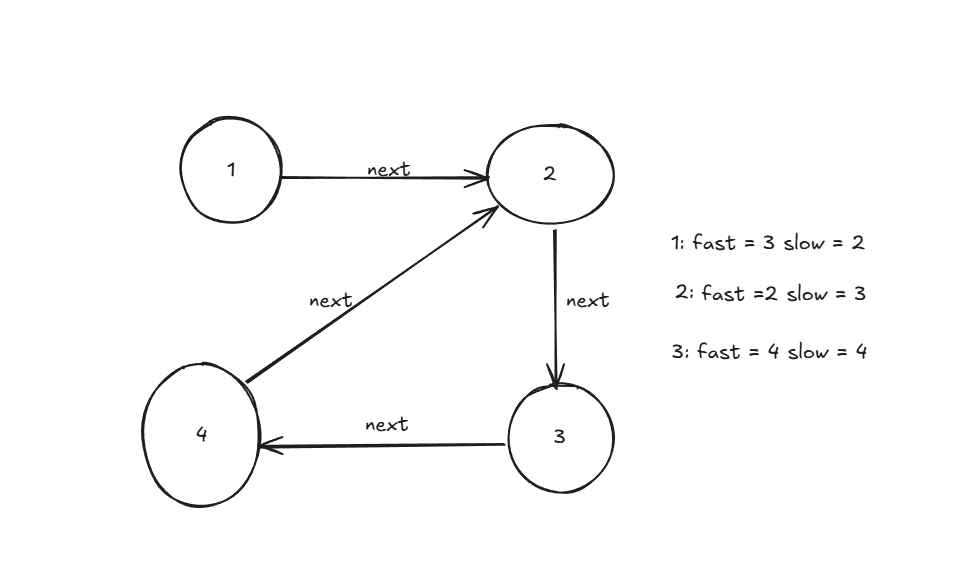

# 常见算法

堆、栈、 队列、 链表、 双指针、随机算法、 二分查找、 排序算法（冒泡、选择、插入、归并、快速）、动态规划、滑动窗口。

## 洗牌

```js
export function shuffleArray<T>(arr: T[]) {
  for (let i = arr.length - 1; i > 0; --i) {
    const j = Math.floor(Math.random() * (i + 1));
    [arr[i], arr[j]] = [arr[j], arr[i]];
  }

  return arr;
}

function shuffle(arr) {
  let n = arr.length;
  for (let i = 0; i < n - 1; i++) {
    // 随机选择一个位置，与当前位置交换
    let j = Math.floor(Math.random() * (n - i)) + i;
    [arr[i], arr[j]] = [arr[j], arr[i]];
  }
  return arr;
}
shuffle([1, 2, 3, 4]);
```

## 随机算法

```js
export function randomItem<T>(arr: T[]) {
  return arr[Math.floor(Math.random() * arr.length)];
}
```

## 双指针


### 链表是否有环

```js
function hasCycle(head) {
  let slow = head;
  let fast = head;
  while (fast && fast.next) {
    slow = slow.next;
    fast = fast.next.next;
    if (slow === fast) return true;
  }
  return false;
}
// 示例： 链表结构
const head = {
  val: 1,
  next: {
    val: 2,
    next: {
      val: 3,
      next: { val: 4, next: head.next }, // 这里形成环
    },
  },
};

hasCycle(head);
```



### 通过删除字母匹配到字典里最长单词

给你一个字符串 s 和一个字符串数组 dictionary ，找出并返回 dictionary 中最长的字符串，该字符串可以通过删除 s 中的某些字符得到。

如果答案不止一个，返回长度最长且字母序最小的字符串。如果答案不存在，则返回空字符串。

```js
var findLongestWord = function (s, dictionary) {
  let str = "";
  for (let i = 0; i < dictionary.length; i++) {
    let left = 0;
    let right = 0;
    const curDic = dictionary[i];

    // 双指针，左指针指向s的当前字符，右指针指向字典单词的当前字符
    while (left < s.length && right < curDic.length) {

      // 如果当前字符相等，则右指针向右移动一位
      if (s.charAt(left) === curDic.charAt(right)) {
        right++;
      }

      // 如果右指针已经移动到字典单词的末尾，则更新最长字符串
      if (right === curDic.length) {
        if (
          curDic.length > str.length ||
          (curDic.length === str.length && curDic < str)
        ) {
          str = curDic;
        }
      }

      // 左指针向右移动一位，继续匹配下一个字符
      left++;
    }
  }
  return str;
};
```

### 